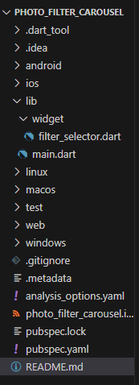
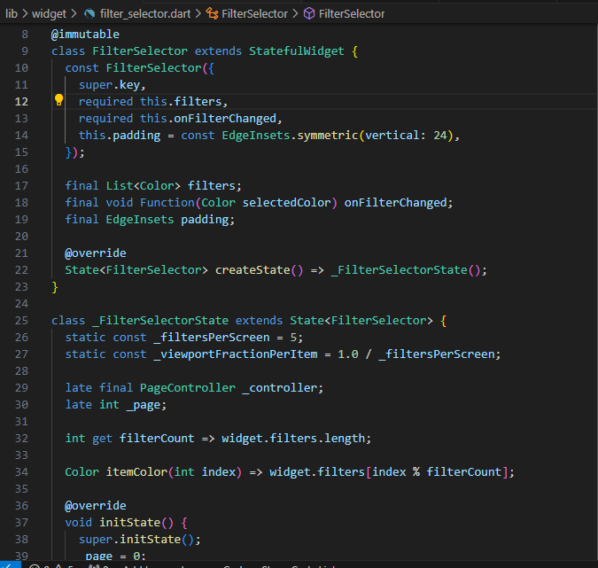
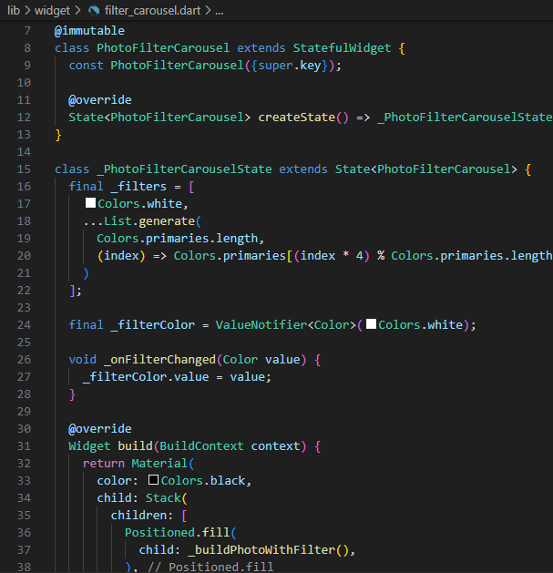
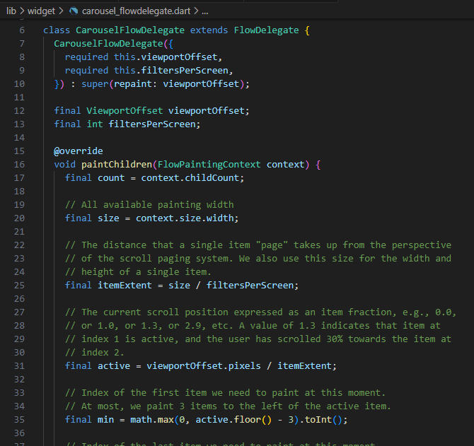
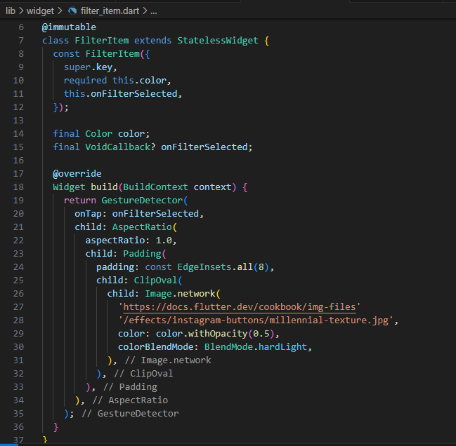
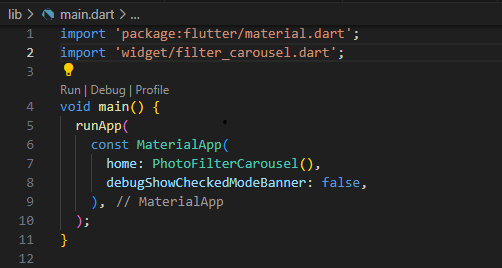
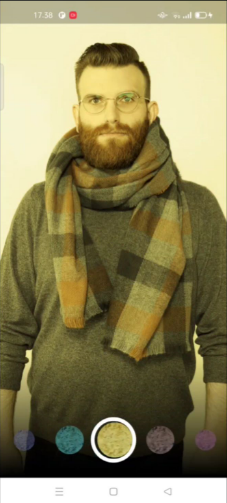

PRAKTIKUM 2

Nama : Febby Mathelda Silvya Mooy

Kelas TI-3A

NIM : 2241720067

Langkah 1: Buat project baru dengan nama photo_filter_carousel

Langkah 2: Buat widget Selector ring dan dark gradient

Langkah 3: Buat widget photo filter carousel

Langkah 4: Membuat filter warna - bagian 1

Langkah 5: Membuat filter warna

Langkah 6: Implementasi filter carousel

Hasil: 

<video controls src="WhatsApp Video 2024-11-09 at 17.44.07_b7aa2850.mp4" title="filter"></video>

